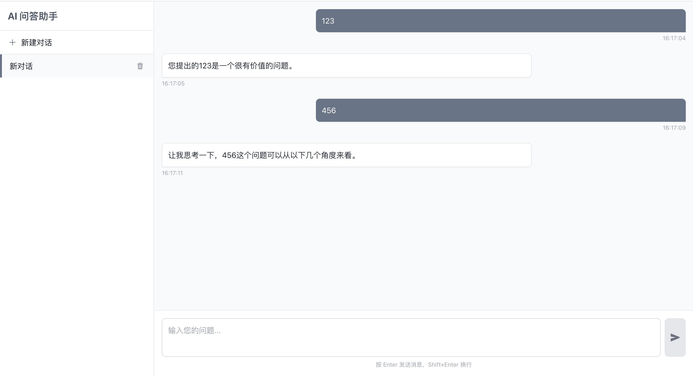

# 问答式 AI 助手文档

## 一、产品需求

本项目时一款类似问答式  AI 助手，通过网页端为用户提供便捷、流畅的交互体验，满足用户多轮对话，以及对话管理等需求，主要功能特点如下：

### （一）交互方式

用户能够在网页上输入文本，向 AI 发起提问，AI 即时回复相应内容，实现多轮交互式问答，以辅助用户获取所需信息或解决相关问题。

### （二）对话管理功能

支持对不同对话进行灵活管理，包括创建新对话、删除已有对话、在多个对话之间进行切换操作，方便用户根据自身需求，开展不同主题的交流或回顾过往对话内容。



## 二、数据库设计

### （一）对话列表数据库

1. 表结构设计
    - 对话 ID：主键，采用字符串数据类型（VARCHAR 36）来唯一标识每个对话，确保其在系统内的唯一性，便于准确关联对话相关的各类数据，以及后续操作基于此进行查询等处理。
    - 对话创建时间：采用日期时间类型存储对话创建的时间戳（DATETIME），方便后续按照时间顺序对对话进行排序、查询以及统计分析等操作，例如用户可以查看最近创建的对话列表等。
    - 对话标题（可选）：依据业务需求，可设置一个对话标题字段，以字符串类型存储（VARCHAR 255），方便用户快速识别对话内容。用户可自行编辑对话主题作为标题，若未设置，系统自动生成一个默认标题，提升对话管理的便捷性。
2. 功能用途：此数据库表，重点用于存储对话的基本信息，可以进行整体管理对话，如展示对话列表、按照时间等条件筛选对话等，并且为后续决定对话历史记录的保存及相应操作，提供依据。

### （二）每一个对话的历史记录数据库

1. 表结构设计
    - 记录 ID：作为主键，通常采用自增长的整数类型（INT AUTO_INCREMENT），来唯一标识每条对话历史记录，确保每条记录，都能在数据库中被精准区分和高效查询。
    - 对话 ID：通过外键与对话列表数据库中的对话 ID 字段建立关联关系 FOREIGN KEY (conversation_id) REFERENCES conversation_list(conversation_id)，采用和对话 ID 对应的数据类型，确保历史记录准确归属到相应的对话之下，方便后续查询某个对话的完整历史记录内容，实现数据的关联性整合。
    - 消息发送方：采用枚举类型（如定义为“用户”“AI”等固定取值）明确每条消息是由哪一方发送的，便于在前端展示时，进行正确的样式区分和消息流向呈现，提升用户查看对话记录的直观性。
    - 消息内容：以字符串类型 TEXT，存储具体的消息文本内容，长度根据预估的最长消息长度合理设置，确保能够完整保存用户与 AI 之间的交互话语，保障对话数据的完整性。
    - 消息发送时间：运用日期时间类型记录每条消息发送的时间戳，依据时间顺序可准确还原对话的先后顺序，在前端展示聊天内容列表时按照此顺序进行排列显示，便于用户清晰回顾对话过程。
2. 功能用途：该数据库表，专门用于详细保存每个对话过程中的所有交互历史记录，为用户回顾对话内容、分析对话情况以及系统进行数据统计、对话质量评估等操作，提供全面且可靠的数据基础，确保对话数据的可追溯性和深度利用价值。

## 三、后端设计

### （一）Websocket 连接机制

1. 连接建立：针对每一个对话，后端需新建一个 Websocket 连接。当用户在前端发起一个新对话（例如点击增加对话按钮，进入对话详情，开始输入内容时），后端接收到相应请求后，立即创建一个专属的 Websocket 连接，并将该连接与对应的对话 ID 进行关联绑定，以此建立起前后端针对该对话的双向通信链路，确保后续消息能准确收发。
2. 消息传递：在对话过程中，用户通过前端输入框发送的消息，会经由对应的 Websocket 连接传输至后端；后端将消息转发给 AI 处理模块，待 AI 生成回复后，再通过同样的 Websocket 连接将回复消息推送回前端，在右侧的聊天内容列表中实时显示出来，形成完整且流畅的交互闭环，保障用户与 AI 之间交流的及时性和连贯性。
3. 连接管理与维护：后端需要对各个 Websocket 连接进行全面且有效的管理。一方面，要实时监控连接状态，例如检测连接是否异常断开等情况，一旦发现连接异常，需及时采取相应的重连策略（如按照一定的时间间隔尝试重新建立连接等）或向用户提示准确的错误信息，确保对话能够正常持续进行；另一方面，在对话结束（比如用户主动删除对话或满足一定的业务规则判定对话结束）时，要及时关闭对应的 Websocket 连接，释放系统资源，提高系统的整体性能和资源利用效率。

### （二）与数据库交互逻辑

1. 对话管理操作：对于对话的增加、删除、切换等管理操作，后端要同步更新对话列表数据库以及相关的对话历史记录数据库。例如，在增加对话时，不仅要在对话列表数据库中新增一条对话记录，还需准备好对应的历史记录存储结构；删除对话时，要从对话列表数据库中移除相应记录，并依据业务规则决定是否删除对应的历史记录；切换对话时，要准确从相应数据库中获取对应对话的历史记录等信息，传递给前端进行展示。
2. 消息交互操作：在用户与 AI 通过 Websocket 进行消息交互过程中，后端要实时将接收到的消息内容以及对应的消息发送方、发送时间等信息，按照对话历史记录数据库的表结构要求，准确插入相应的记录，确保对话历史记录的完整保存，同时也为后续的数据分析、查询等功能提供准确的数据支撑。

## 四、前端设计

### （一）整体布局

采用网页左右布局的方式，将整个页面清晰划分为两个主要区域，左侧为对话列表区域，右侧为对话详情展示及交互区域，通过这种布局形式，方便用户直观操作与查看对话相关内容，提升交互体验的便捷性。

### （二）左侧对话列表

1. 对话 ID 展示：每个对话在列表中都展示其唯一独立的 ID，该 ID 以清晰可见的方式呈现（如在对话条目的特定位置显示等），方便用户在需要时（如反馈问题、进行技术排查等场景）准确告知相关人员具体的对话标识，便于系统对不同对话进行精准定位与操作。
2. 功能操作按钮设计
    - 增加对话：在对话列表区域设置明显的“增加对话”按钮（可采用易于识别的图标，如“+”号图标等，同时搭配相应文字说明），方便用户一键新建一个对话，开启与 AI 的新交互场景。每次点击该按钮后，系统自动生成对应的对话 ID，并在对话列表中实时显示相应的对话条目，整个操作过程简洁流畅，符合用户操作习惯。
    - 删除对话：针对已存在的对话条目，为每个对话配备相应的“删除对话”按钮（可设计为垃圾桶图标等直观形式，并且设置合理的颜色区分，如红色表示删除操作，以起到警示作用），用户点击该按钮后，弹出确认提示框（提示内容清晰明确，告知用户删除操作的后果，如“确认删除该对话吗？此操作不可恢复！”等），防止误删。一旦用户确认删除，该对话将从对话列表中移除，同时后端会依据相关业务规则处理对应的相关记录（如是否删除数据库中的历史记录等）。
    - 切换当前对话列表：用户可以通过鼠标点击不同的对话条目来实现当前操作焦点的切换，被选中的对话条目以突出显示的方式（如改变背景颜色、加粗字体等）呈现，此时右侧的对话详情区域会相应展示该对话对应的聊天内容等信息，方便用户在多个对话之间灵活切换查看与继续交互，操作简单直观，提升用户多对话管理的效率。

### （三）右侧对话详情

1. 聊天内容列表展示：在该区域上方，以清晰、有条理的方式展示用户与 AI 在当前对话中的所有交互消息记录。每条消息需明确区分是用户发送还是 AI 回复，通过不同的样式进行直观展示，例如用户发送的消息以一种颜色（如蓝色）的消息框显示，AI 回复的消息以另一种颜色（如绿色）的消息框显示，并且消息按照发送时间顺序依次排列，如同聊天界面一样自然流畅，方便用户回顾交流内容，清晰了解对话的整个流程。
2. 用户输入框设计：位于右侧区域下方，为用户提供一个简洁且功能完善的输入文本区域。输入框需支持常规的文本编辑操作，如复制、粘贴、删除、换行等，同时配备合适的提示文字（例如“请输入您的问题”等）引导用户进行输入，确保用户能够方便快捷地输入想要询问 AI 的问题或语句。此外，为提升操作便捷性，可支持回车键发送消息的快捷操作方式，同时也设置一个明显的“发送”按钮（按钮上可显示“发送”字样或采用相应的发送图标等），方便用户将输入的内容发送给 AI 进行交互，整体设计符合用户在网页端输入文本的交互习惯。

## 五、用户使用说明

### （一）对话操作

1. 新建对话：访问产品网页后，在网页左侧的对话列表区域，点击“增加对话”按钮（图标通常为“+”号），即可创建一个新对话，此时右侧的对话详情区域将准备好相应的聊天内容显示和输入框，等待您输入内容与 AI 进行交流。
2. 切换对话：若您之前创建了多个对话，想要查看不同对话的内容，只需在左侧对话列表中点击相应的对话条目，被选中的对话将以突出显示的方式呈现，同时右侧区域会立即切换显示该对话的聊天内容，方便您回顾或继续在此对话中与 AI 交流。
3. 删除对话：对于不再需要的对话，在左侧对话列表中找到对应的对话条目，点击其旁边的“删除对话”按钮（图标通常为垃圾桶），系统会弹出确认提示框，确认要删除后，该对话将从列表中移除，相应的对话记录（根据业务规则，可能包括数据库中的历史记录等）也会进行相应处理。

### （二）与 AI 交互

在右侧对话详情区域的输入框中，输入您想要询问 AI 的问题或语句，输入完成后，可以通过点击“发送”按钮或者直接按下回车键，将消息发送给 AI。AI 会在短时间内回复您的问题，回复内容将显示在聊天内容列表中，您可以继续在输入框中输入新的问题，与 AI 进行多轮对话，以获取更全面的解答或深入探讨相关话题。

## 六、部署与维护

### 第一步：启动 MySQL 服务
1. 确保已安装 Docker 和 Docker Compose
2. 在项目根目录（`/xxx/ai-chat/`）下执行以下命令：
   ```bash
   docker compose up
   ```
   （此命令会自动启动 MySQL 服务，并将数据持久化到 `/xxx/ai-chat/mysql-data` 目录， xxx 根据实际情况自行设置）
3. 进入 MySQL 容器
   ```bash
   docker exec -it ai_chat_db bash
   mysql -u root -p
   ```
   （其中 `ai_chat_db` 是 MySQL 容器的名称，根据实际情况替换）
4. 初始化数据库，执行 `init.sql` 文件
   ```sql
   source /xxx/ai-chat/init.sql
   ```
5. 退出 MySQL 容器
   ```bash
   exit
   ```

### 第二步：启动后端服务
1. 新建一个终端窗口
2. 进入后端项目目录：
   ```bash
   cd /xxx/ai-chat/backend  # 假设后端代码在 backend 目录下
   ```
3. 安装依赖：
   ```bash
   npm install
   ```
4. 启动后端服务器（默认运行在 3000 端口）：
   ```bash
   npm run start
   ```

### 第三步：启动前端服务
1. 再新建一个终端窗口
2. 进入前端项目目录：
   ```bash
   cd /xxx/ai-chat/frontend  # 假设前端代码在 frontend 目录下
   ```
3. 安装依赖：
   ```bash
   npm install
   ```
4. 启动前端服务（运行在 3001 端口）：
   ```bash
   npm run start
   ```

### 第四步：使用 AI 助手
1. 前端服务启动后会自动打开浏览器（如未自动打开，手动访问 `http://localhost:3001`）
2. 在打开的页面中即可使用 AI 助手进行对话交互：
   - 点击左侧"+"按钮创建新对话
   - 在右侧输入框中输入问题并发送
   - 可在多个对话间切换或删除不需要的对话

### 注意事项
- 确保三个服务（MySQL、后端、前端）按顺序启动
- 首次启动，可能需要等待依赖安装，数据库初始化，根据网络情况，可能需要一定时间
- 若 3000 3001 端口被占用，需修改对应配置文件中的端口号
